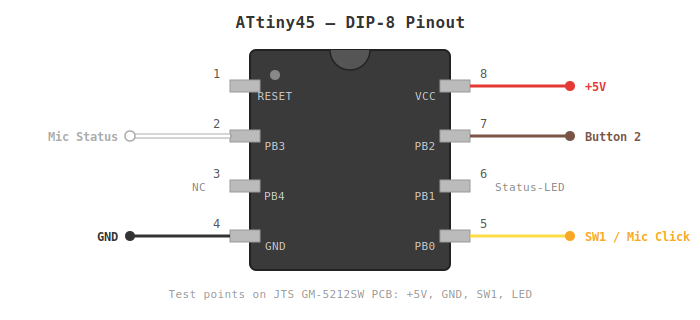
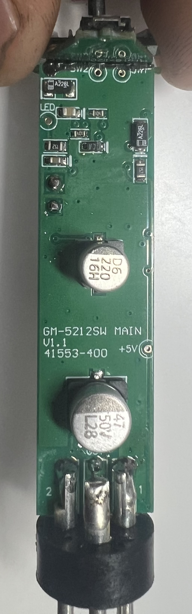

# MicButton - ATtiny45 Controller

[](https://github.com/Nebensound/MicButton/actions/workflows/test.yml)

A Rust-based microcontroller for a microphone button, built for the ATtiny45.

## Hardware

- **MCU**: ATtiny45 @ 1 MHz (internal oscillator, CKDIV8 active)
- **Microphone**: JTS GM-5212SW (electret gooseneck microphone with on/off switch)
- **Transistor**: D882 NPN (TO-126) – bridges SW1↔SW2 to simulate a button press
- **Buttons**: Push buttons on PB0 (3.3V pull-up on mic PCB) and PB2 (internal pull-up)
- **LED**: Status LED on PB4
- **Mic Status**: Input on PB3 (HIGH = mic on)

### Wiring

The ATtiny45 is installed inside the metal housing of the JTS GM-5212SW. The microphone's PCB has test points that can be used directly for wiring:



| Test Point | ATtiny45 Connection   | Pin | Cable Color |
| ---------- | --------------------- | --- | ----------- |
| `+5V`      | VCC                   | 8   | Red         |
| Chassis    | GND                   | 4   | Black       |
| `SW1`      | PB0 (Button 1 read)   | 5   | Yellow      |
| `SW1`      | D882 Collector        | –   | –           |
| `SW2`      | D882 Emitter          | –   | –           |
| –          | PB1 → 1kΩ → D882 Base | 6   | Blue        |
| `LED`      | PB3 (Mic Status)      | 2   | White       |
| –          | PB4 (Status LED)      | 3   | –           |
| –          | PB2 (Button 2)        | 7   | Brown       |



The 3 Pole XLR connector is replaced with a 5 Pole XLR connector to be able to wire out the Button 2 signal.

## How It Works

### Mic Click Circuit

The mic PCB uses a 3.3V IC with a voltage divider on the button line:

- **SW1**: 3.3V pull-up (~200kΩ) – reads ~3V when open, ~1V when pressed
- **SW2**: 91kΩ to GND – reads 0V when open, ~1.1V when pressed
- The physical button bridges SW1↔SW2

The ATtiny cannot bridge these directly (its GND is chassis ground, not SW2). A **D882 NPN transistor** is used as an electronic switch:

- **PB1 HIGH** → D882 conducts → SW1↔SW2 shorted (= button press)
- **PB1 LOW** → D882 off → no effect

### Buttons

- **Button 1 (PB0)**: Reads SW1 from the mic PCB (3.3V pull-up, no internal pull-up). A press pulls SW1 to ~1V which is detected as LOW. To trigger a mic click, PB1 drives the D882 transistor.
- **Button 2 (PB2)**: Simple button input (internal pull-up). Works identically to Button 1 – also triggers the D882 via PB1.

Both buttons are interchangeable and can be pressed individually or simultaneously.

### Behavior

- **Short press**: Mic toggle (on → 10 s timer, off → immediately off)
- **Press and hold** (≥500 ms): Mic on while held, off on release
- **Mic status sync**: Detects mismatches via PB3 and corrects after 500 ms
- **Status LED**: Blinks in timer mode, solid on during hold, 2× blink on startup

## ATtiny45 Pin Assignment

| Pin | Function                      | Direction                |
| --- | ----------------------------- | ------------------------ |
| PB0 | Button 1 (reads SW1)          | Input (3.3V PCB pull-up) |
| PB1 | Mic Click (D882 Base via 1kΩ) | Output                   |
| PB2 | Button 2                      | Input (internal pull-up) |
| PB3 | Mic Status                    | Input (HIGH = mic on)    |
| PB4 | Status LED                    | Output                   |
| VCC | 5 V                           | –                        |
| GND | Ground (chassis)              | –                        |

## Prerequisites

```bash
# Rust Nightly (automatically activated via rust-toolchain.toml)
rustup install nightly
rustup component add rust-src --toolchain nightly
```

### AVR-GCC Toolchain

**macOS:**

```bash
brew install avr-gcc avrdude
```

**Ubuntu/Debian:**

```bash
sudo apt install gcc-avr avr-libc avrdude
```

**Windows (MSYS2):**

```bash
pacman -S mingw-w64-x86_64-avr-gcc mingw-w64-x86_64-avrdude
```

## Build

```bash
cargo avr-build
# or
make build
```

## Test

The state machine logic is hardware-independent in `src/logic.rs` and tested on the host:

```bash
cargo test --lib
```

## Programmer (USBasp → ATtiny45)

The ATtiny45 is flashed via the ISP interface using a USBasp programmer. The wiring is identical to the ATtiny85 (same DIP-8 pinout).

### ISP Wiring

| USBasp (10-Pin Header) | ATtiny45 Pin | Function |
| ---------------------- | ------------ | -------- |
| MOSI                   | PB0 (Pin 5)  | Data In  |
| MISO                   | PB1 (Pin 6)  | Data Out |
| SCK                    | PB2 (Pin 7)  | Clock    |
| RESET                  | PB5 (Pin 1)  | Reset    |
| VCC                    | VCC (Pin 8)  | +5 V     |
| GND                    | GND (Pin 4)  | Ground   |

> **Tip:** The USBasp powers the ATtiny45 through the ISP header – no external power supply needed.

### Fuses (8 MHz Internal Oscillator)

```bash
# Read fuses
avrdude -c usbasp -p t45 -U lfuse:r:-:h -U hfuse:r:-:h -U efuse:r:-:h

# Set fuses: 8 MHz internal, no CKDIV8
avrdude -c usbasp -p t45 -U lfuse:w:0xe2:m -U hfuse:w:0xdf:m -U efuse:w:0xff:m
```

> **Further reading:** [Programming ATtiny MCUs with USBasp (Arduino Project Hub)](https://projecthub.arduino.cc/tusindfryd/programming-attiny-mcus-with-usbasp-and-arduino-ide-012487) – the ATtiny45 can be programmed exactly like the ATtiny85 described there.

## Flash

```bash
cargo avr-flash
# or
make flash
```

`cargo avr-flash` builds the project and automatically invokes `flash.sh` (objcopy + avrdude).

<details>
<summary>Flash manually</summary>

```bash
# ELF → HEX
avr-objcopy -O ihex -R .eeprom target/avr-attiny45/release/mic-button.elf target/avr-attiny45/release/mic-button.hex

# Flash with avrdude (USBasp programmer)
avrdude -c usbasp -p t45 -U flash:w:target/avr-attiny45/release/mic-button.hex:i
```

</details>

> **Note:** Disconnect the programmer after flashing – PB1 (MISO) will otherwise be driven by the ISP, causing the LED to stay on permanently.

## Project Structure

| File                | Description                                             |
| ------------------- | ------------------------------------------------------- |
| `src/main.rs`       | Hardware init, GPIO, timer, ISR – ATtiny45-specific     |
| `src/logic.rs`      | State machine, testable without hardware                |
| `src/lib.rs`        | Library crate for tests                                 |
| `avr-attiny45.json` | Custom target spec for the ATtiny45                     |
| `Makefile`          | Build, test, and flash targets                          |
| `flash.sh`          | Runner script for `cargo avr-flash` (objcopy + avrdude) |
